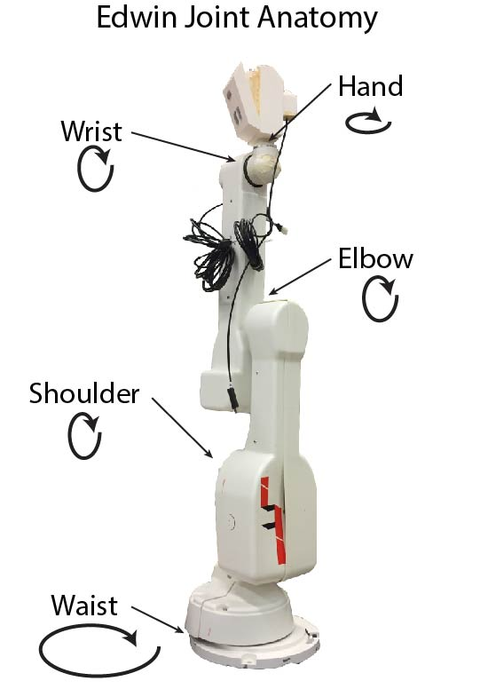

### Installation

[Click here for installation instructions.](install_edwin)

### Startup (Minimal)

Run Edwin with the minimal amount of code necessary to actuate him.

  1. Run [roscore](http://wiki.ros.org/roscore) in a new Terminal window.
  2. Press Ctrl-Alt-T to start a new Terminal tab.
  3. Plug the USB cord into a port on your computer. The connector (pictured below) uses a usb serial connector to connect to the robot. Wait until the green light
  is blinking slowly.
  

  4. Turn Edwin on by flipping the power button on his electronics box to "|". (Pictured below)
  

  5. In your new terminal, cd into the scripts folder in the edwin folder
  6. run `rosrun edwin arm_node.py` to start the arm node
  7. In a new Terminal window, run `roslaunch edwin robot_minimal.launch` to start peripheral things
  8. (a) To test functionality, run `rosrun edwin test_arm_pub.py` in a new Terminal window\s\s
     (b) To run code, open a new Terminal window and run your code.\s\s

If you followed 7a, you can now move Edwin to various positions. If you followed
7b, Edwin should execute your code.

### Moving Edwin (test_arm_pub)

Input numbers into a GUI to position Edwin.

The ST-R17 arm that Edwin is based on has 5 main pivot points: Waist, Shoulder,
Elbow, Wrist, and Hand. Each of these has an input line in the test_arm_pub GUI.
Additionally, the GUI (Pictured below) has 6 other inputs: Route, XYZ, Behavior, Say, and CMD.\s\s
- Wrist-Waist: To use joints, input a small number to test Edwin's range. Playing with numbers such as 100 and -100 before moving to positions is a good idea when you don't have a good idea of what inputs move Edwin where. Additionally, Edwin's values drift over time, so moving his shoulder to 1000 will be a slightly different position than it used to be. The numerical inputs to the joints are measured (roughly) in tenths of a degree... maybe?
- Route: To use routes, familiarize yourself with the routes that Edwin can run inside create_routes.py. These are strings of movements that Edwin can do.
- XYZ: Edwin has a coordinate system that he can reference. The coordinates place Edwin's wrist, not his head, so the limiters that don't let Edwin run himself into the ground will still let you run the head into the ground. Be very careful. Additionally, for Edwin to move to a position, a number needs to be in each box, and the user must push the "Set" button, not press "Enter".

# [Something wrong? Click here.](troubleshooting)

*This Github page is currently under construction. Last edited on 1/29/17 by [C.Novak](https://github.com/ConnorNovak).*
